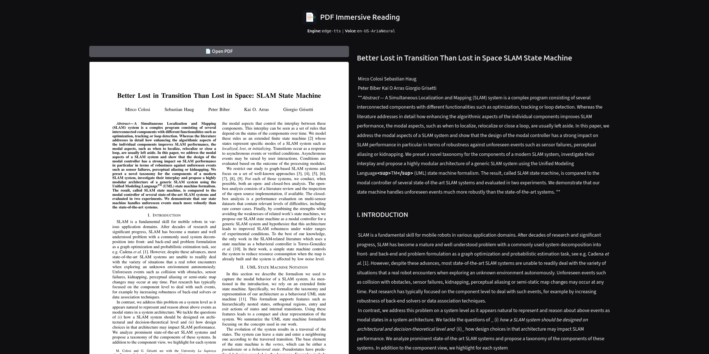

<div align="center">


# PDF Immersive Reading

**Read PDFs aloud, sentence by sentence, with the spoken text highlighted as you listen.**

[](https://www.python.org/downloads/)
[](LICENSE)
[](https://gradio.app)
[](#privacy-and-network-use)

</div>

---

A local Gradio app that turns a PDF into an audiobook you can follow along with.
The page image sits on the left, the extracted text on the right, and the sentence
being spoken is highlighted — word by word when the engine supports it. Click any
word to jump there. Nothing is uploaded except, with the default engine, the
sentence text sent to Microsoft's speech endpoint (see
[Privacy and network use](#privacy-and-network-use)).

<div align="center">

</div>

## Why this exists

Reading a dense paper is easier when you can hear it and see where you are at the
same time. Existing "read aloud" buttons either read the whole page as one
undifferentiated blob, lose the reading order on two-column layouts, or ship as a
cloud service you have to hand your documents to. This app keeps the document on
your machine, splits it into real sentences, and keeps the audio and the highlight
in sync so you never lose your place.

## Features

- **Sentence-level playback** with live highlighting, and **word-level highlighting**
  with `edge-tts` (driven by the engine's real word-boundary timestamps).
- **Click-to-seek** — click any word or sentence to start reading from there.
- **Page image alongside the text**, so figures and layout stay in view.
- **Pluggable TTS engines**: `edge-tts` (default), Kokoro, and XTTS-v2.
- **Pluggable PDF → markdown converters**, swappable live from a dropdown without
  restarting or re-uploading.
- **Prefetch pipeline** that synthesizes sentences ahead of playback, so audio
  starts without a gap between sentences.
- **On-disk cache** keyed by document, engine, converter, and voice — rewinding or
  re-opening a document you've already read is instant.
- **Playback speed** from 0.5× to 2×, applied in the browser rather than
  re-synthesized.
- **Light default install**: no ML models, no multi-gigabyte downloads. Heavy
  backends are opt-in.

## Quick start

```bash
python3 -m venv .venv
.venv/bin/pip install -r requirements.txt
.venv/bin/python app.py
```

Open <http://127.0.0.1:7860>, click **Open PDF**, and press play.

Or pass the document on the command line to skip the file picker:

```bash
.venv/bin/python app.py paper.pdf
```

The default install gives you the `edge-tts` engine plus the `plain` and
`pymupdf4llm` converters — no model weights, nothing heavy. Everything else is
opt-in:

```bash
.venv/bin/pip install -r requirements-optional.txt   # all extras at once
# or just what you need:
.venv/bin/pip install kokoro                # tts.engine: kokoro
.venv/bin/pip install coqui-tts             # tts.engine: xtts
.venv/bin/pip install docling               # converter: docling
.venv/bin/pip install marker-pdf            # converter: marker
.venv/bin/pip install "markitdown[pdf]"     # converter: markitdown
```

Each optional backend imports its dependency only when you actually select it, so
the app still boots normally if it isn't installed.

## Configuration

Everything lives in [`config.yaml`](config.yaml): TTS engine and voice, render DPI,
prefetch depth, cache location, and the host/port to bind.

Two settings behave differently on purpose:

| Setting | When it takes effect |
|---|---|
| `tts.engine` / voice | Read once at startup. Changing it requires a restart — local engines load their model at boot, and swapping mid-session would be a much larger machine to maintain. |
| `pdf.converter` | Only the *starting* value of a live GUI dropdown. Switching converters re-processes the open PDF immediately. |

`HOST` and `PORT` environment variables override the `server` section, which is how
the Docker image picks its port without editing the config file.

## TTS engines

| Engine | Runs | Highlighting | Notes |
|---|---|---|---|
| `edge-tts` | Microsoft cloud endpoint | Word-level | Default. Fast, natural, needs a network connection. |
| `kokoro` | Locally, CPU or CUDA | Sentence-level | Fully offline after a one-time model download. |
| `xtts` | Locally, CUDA recommended | Sentence-level | Highest quality of the local options, slowest on CPU. Built-in speaker only. |

Kokoro and XTTS return no per-word timing, and no forced-alignment model is used to
approximate it — hence sentence-level highlighting only for those two.

## PDF → markdown converters

| Converter | Dependencies | Model | Notes |
|---|---|---|---|
| `plain` | none | none | Raw text extraction, no markdown structure. Always available. |
| `pymupdf4llm` | light | none | Heuristic markdown, fast, CPU-only. Default. Can drop punctuation on some layouts. |
| `markitdown` | light | none | Generalist converter. Treats the whole document as one page, so per-page navigation is unavailable. |
| `docling` | heavy | small, local | Layout-aware, good tables and reading order. Downloads once, then runs offline. |
| `marker` | heaviest | several, local | Full layout, OCR, and equation pipeline. Most precise and slowest; whole document as one page. |

All converter models run locally after their one-time download. Because the cache is
keyed by converter as well as engine and voice, trying a different converter never
invalidates what you already synthesized with the previous one.

## Docker

```bash
docker build -t pdf-active-reader .
docker run -t -p 7860:7860 pdf-active-reader

# with a document opened at startup — the container can only see what you mount
docker run -t -p 7860:7860 -v "$PWD":/docs:ro pdf-active-reader /docs/paper.pdf
```

The image's entrypoint is `python app.py`, so anything after the image name is
passed straight through as its arguments.

`make docker` is a shortcut for the two commands above:

```bash
make docker                    # port 7860
make docker PORT=9999          # any other port
make docker PDF=paper.pdf      # mounts the file's directory and opens it
```

Pick a different port with `-e PORT=9999 -p 9999:9999`. The image installs
`requirements.txt` only; for Kokoro, XTTS, Docling, marker, or MarkItDown you'll
want a derived image that also installs `requirements-optional.txt`. The cache is
not persisted across container restarts unless you mount a volume at `/app/.cache`.

## How it works

```
PDF ──▶ converter ──▶ markdown ──▶ segmenter ──▶ Sentence[] ──▶ TTS engine ──▶ audio
                                                      │                          │
                                                      └──── PlaybackController ──┘
                                                              (prefetch, cache,
                                                               seeks, highlight)
```

**Segmentation** is its own layer for a specific reason. PDF text arrives with a
hard newline at every visual line wrap, so running a sentence splitter on it
directly splits at line wraps instead of at punctuation. `text/segmenter.py` first
groups the markdown into blocks (heading, list item, paragraph), joins the wrapped
lines *within* each block, and only then runs [pysbd](https://github.com/nipunsadvilkar/pySBD)
on the joined text. Each `Sentence` carries both a cleaned, speakable version for
the TTS engine and the original markup for rendering.

**`playback/controller.py`** is the state machine at the center of the app. It runs
a producer/consumer prefetch pool that synthesizes a couple of sentences ahead of
playback, tags every seek and page turn with a generation counter so in-flight work
from before the seek bails out instead of occupying a worker, and wraps each engine
call in its own timeout so a network stall can't permanently shrink the pool.

**Highlighting** is deliberately kept outside Gradio's re-render cycle. The
`<audio>` element is created once by `frontend/highlight.js` and reads a small
signal element for the current sentence, generation, and audio source; the text
panel can re-render as often as it likes without ever restarting playback.

| Path | Contents |
|---|---|
| `app.py` | Gradio UI and event wiring |
| `engines/` | TTS backends behind a common `TTSEngine` interface |
| `pdf/converters/` | PDF → markdown backends behind a common `PDFConverter` interface |
| `text/` | Sentence segmentation and inline-markdown handling |
| `playback/` | Playback state machine, prefetch, and on-disk cache |
| `frontend/highlight.js` | Audio element and highlight synchronization |

## Tests

```bash
.venv/bin/python tests/test_pipeline.py
```

A single runnable script using plain asserts, not pytest. It substitutes a fake
in-process TTS engine, so it makes no network calls and finishes in a few seconds.

## Privacy and network use

- The server binds `127.0.0.1` by default and has **no authentication** — it is
  designed for a single user on their own machine, not for a LAN or shared host.
- **`edge-tts`, the default engine, is not offline.** Every sentence you play is
  sent to a Microsoft cloud endpoint for synthesis, even though the library runs
  locally. Switch to Kokoro or XTTS if your documents can't leave the machine.
- Kokoro and XTTS download their weights once and then run entirely offline. All
  PDF converters, including the model-based ones, behave the same way.
- Rendered page images and synthesized audio are written to `./.cache`.

## Limitations

- A sentence that spans a page break is read as two sentences.
- Reading position isn't restored across restarts.
- Repeated header/footer stripping is implemented for the `plain` converter only;
  with the others a running header may be read aloud as its own sentence.
- `markitdown` and `marker` return the document as a single page, so page
  navigation is unavailable with them.
- No voice cloning — XTTS uses its built-in default speaker.

## License

[BSD 3-Clause](LICENSE).
